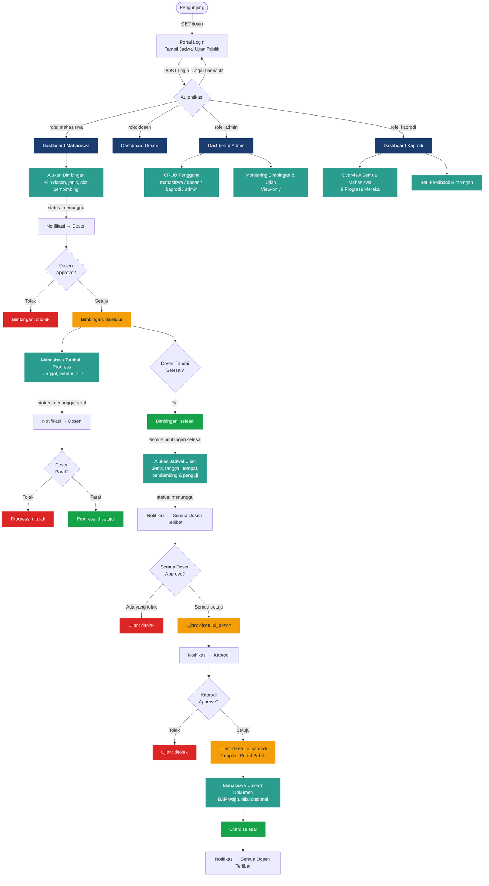

# BIOS Track

## Description

BIOS Track adalah aplikasi web fullstack untuk manajemen bimbingan dan ujian skripsi mahasiswa. Sistem ini mengotomasi alur pengajuan bimbingan, pencatatan progress, penjadwalan ujian, dan persetujuan bertingkat (dosen → kaprodi). Halaman login berfungsi sebagai portal publik yang menampilkan jadwal ujian yang telah disetujui.

---

## Tech Stack

| Layer | Teknologi |
|---|---|
| Backend | PHP 8.2+, Laravel 12 |
| Frontend | Blade Templating|
| Build Tool | Vite 7 + `laravel-vite-plugin` |
| Database | MySQL (berdasarkan penggunaan `ALTER TABLE` pada migrations) |
| PDF Generation | `barryvdh/laravel-dompdf` 3.1 |
| HTTP Client | `axios` 1.11 |
| Dev Tools | Laravel Pail, Laravel Pint, Laravel Sail, PHPUnit 11 |

---

## Features

Fitur berikut **benar-benar ada** berdasarkan source code:

### Autentikasi & Akun
- Login dengan email/password dan opsi "remember me"
- Registrasi mandiri oleh mahasiswa (role otomatis `mahasiswa`)
- Logout dengan session invalidation
- Update profil: nama, nomor telepon, upload tanda tangan digital (image), ganti password
- Pemblokiran akun: login ditolak jika `is_active = false`

### Portal Publik (Halaman Login)
- Menampilkan daftar ujian yang sudah disetujui kaprodi (`status = disetujui_kaprodi`) dan belum upload dokumen
- Data ditampilkan tanpa login (guest), dibatasi 50 ujian mendatang

### Manajemen Bimbingan (Mahasiswa)
- Pengajuan bimbingan dengan memilih dosen, jenis bimbingan, posisi pembimbing (1 atau 2), topik, dan catatan
- Jenis bimbingan: Proposal, Seminar Hasil, Ujian Sidang Akhir
- Setiap jenis bimbingan mendukung maksimal 2 pembimbing (slot terpisah)
- Lihat detail dan status bimbingan
- Riwayat semua bimbingan
- Export riwayat bimbingan ke PDF

### Progress Bimbingan (Mahasiswa)
- Tambah entri progress (tanggal, catatan, upload file: pdf/doc/docx/jpg/jpeg/png maks 5MB) setelah bimbingan disetujui dosen
- Edit entri progress yang sudah ada
- Setiap entri progress menunggu paraf (persetujuan) dosen

### Manajemen Ujian (Mahasiswa)
- Pengajuan jadwal ujian (hanya bisa jika **semua** bimbingan berstatus `selesai`)
- Input: jenis ujian, tanggal & tempat, 1–2 dosen pembimbing, 1–2 dosen penguji
- Lihat status dan riwayat ujian
- Edit pengajuan ujian
- Upload dokumen pasca-ujian (berkas BAP wajib, berkas nilai opsional) setelah ujian disetujui kaprodi → ujian otomatis berstatus `selesai`

### Dashboard & Workflow Dosen
- Dashboard dengan statistik bimbingan dan ujian
- Melihat list bimbingan dari mahasiswa bimbingannya
- Approve atau tolak pengajuan bimbingan (dengan catatan dosen)
- Menandai bimbingan sebagai `selesai` atau `tidak selesai`
- Memberikan paraf (approve/tolak) pada setiap entri progress bimbingan
- Approve atau tolak pengajuan ujian

### Dashboard & Workflow Kaprodi
- Dashboard overview semua mahasiswa, bimbingan, dan ujian
- List dan detail semua mahasiswa beserta progresnya
- Oversight semua bimbingan + memberikan feedback/catatan
- Approval akhir ujian: hanya bisa dilakukan setelah **semua dosen** approve (`status = disetujui_dosen`)
- Akses rute dosen juga tersedia untuk kaprodi (middleware `role:dosen,kaprodi`)

### Dashboard & Manajemen Admin
- Dashboard statistik pengguna (total per role, user aktif)
- CRUD pengguna (mahasiswa, dosen, kaprodi, admin) dengan pagination dan filter
- Toggle aktif/nonaktif akun pengguna
- Monitoring bimbingan dan ujian (view-only, tanpa aksi approval)
- Monitoring detail per mahasiswa

### Notifikasi In-App
- Notifikasi dikirim otomatis pada setiap event (pengajuan bimbingan, approval, progress baru, dll.)
- Tampilan unread count di semua halaman
- Ambil notifikasi unread via JSON API (`GET /notifications/unread`)
- Tandai satu atau semua notifikasi sebagai dibaca
- Redirect ke halaman terkait saat notifikasi dibuka

### Kartu Kendali
- Tampilan kartu kendali bimbingan mahasiswa (`mahasiswa/kartu-kendali.blade.php`)

---

## Roles & Access Control

Sistem memiliki **4 role** yang dikontrol oleh `RoleMiddleware`. Setiap role memiliki prefix URL dan hak akses yang berbeda.

### Ringkasan Role

| Role | Prefix URL | Cara Dibuat | Hak Utama |
|---|---|---|---|
| `mahasiswa` | `/mahasiswa/` | Registrasi mandiri | Ajukan bimbingan, catat progress, ajukan ujian, upload dokumen |
| `dosen` | `/dosen/` | Dibuat oleh admin | Approve bimbingan, paraf progress, approve ujian |
| `kaprodi` | `/kaprodi/` + `/dosen/` | Dibuat oleh admin | Semua akses dosen + approval final ujian + oversight semua data |
| `admin` | `/admin/` | Dibuat via Tinker | CRUD user, monitoring bimbingan & ujian (view-only) |

---

### Detail Per Role

#### Mahasiswa
- Melakukan registrasi sendiri melalui `/register`
- Mengajukan bimbingan (memilih dosen, jenis bimbingan, slot pembimbing 1 atau 2)
- Mencatat setiap sesi bimbingan sebagai progress (dengan catatan dan upload file)
- Mengajukan jadwal ujian — **hanya setelah semua bimbingan selesai**
- Mengupload dokumen BAP pasca-ujian — ujian otomatis berstatus `selesai`
- Ekspor riwayat bimbingan ke PDF

#### Dosen
- Akun dibuat oleh admin
- Menerima notifikasi untuk setiap pengajuan bimbingan atau progress baru
- Menyetujui/menolak pengajuan bimbingan
- Memberikan paraf (approve/tolak) pada setiap entri progress bimbingan
- Menandai bimbingan sebagai selesai
- Menyetujui/menolak jadwal ujian

#### Kaprodi
- Memiliki **semua akses dosen** (middleware `role:dosen,kaprodi`)
- Ditambah akses eksklusif di prefix `/kaprodi/`:
  - Melihat daftar dan detail semua mahasiswa
  - Melihat semua bimbingan + memberikan catatan/feedback
  - **Approval final ujian** — hanya bisa dilakukan setelah semua dosen menyetujui

#### Admin
- Akun dibuat manual via `php artisan tinker`
- Membuat, mengedit, menghapus, dan menonaktifkan akun pengguna semua role
- Memantau semua data bimbingan dan ujian (**hanya baca**, tidak ada aksi approval)

---

### Flowchart Alur Sistem



---

## Project Structure

```
bios-track/
├── app/
│   ├── Http/
│   │   ├── Controllers/
│   │   │   ├── AdminController.php         # CRUD user, monitoring (admin only)
│   │   │   ├── AuthController.php          # Login, register, logout, profile
│   │   │   ├── BimbinganController.php     # CRUD bimbingan (mahasiswa & dosen)
│   │   │   ├── BimbinganProgressController.php  # Progress bimbingan + paraf dosen
│   │   │   ├── DashboardController.php     # Dashboard per role + export PDF
│   │   │   ├── DosenController.php         # (File ada, belum digunakan di routes)
│   │   │   ├── KaprodiController.php       # Oversight mahasiswa & approval ujian
│   │   │   ├── NotificationController.php  # Notifikasi (list, read, JSON API)
│   │   │   ├── UjianController.php         # CRUD ujian (mahasiswa & dosen)
│   │   │   └── UjianDokumenController.php  # Upload dokumen pasca-ujian
│   │   └── Middleware/
│   │       └── RoleMiddleware.php          # Guard akses berdasarkan role
│   ├── Models/
│   │   ├── User.php                        # Role helper + relasi ke semua entitas
│   │   ├── Bimbingan.php                   # Model bimbingan dengan konstanta JENIS
│   │   ├── BimbinganProgress.php           # Entri progress per sesi bimbingan
│   │   ├── Ujian.php                       # Jadwal ujian + status per dosen
│   │   ├── UjianDokumen.php                # Dokumen BAP & nilai pasca-ujian
│   │   └── Notification.php               # Notifikasi in-app dengan helper send()
│   └── Providers/
│       └── AppServiceProvider.php
├── database/
│   ├── migrations/                         # 12 file migrasi MySQL
│   └── seeders/
│       └── DatabaseSeeder.php
├── resources/
│   ├── views/
│   │   ├── layouts/                        # Layout utama aplikasi
│   │   ├── auth/                           # Login, register, profile
│   │   ├── mahasiswa/                      # Dashboard, bimbingan, ujian, kartu kendali
│   │   ├── dosen/                          # Dashboard, bimbingan, ujian
│   │   ├── kaprodi/                        # Dashboard, mahasiswa, bimbingan, ujian
│   │   ├── admin/                          # Dashboard, users, monitoring
│   │   └── shared/                         # Komponen bersama (notifikasi)
│   ├── css/app.css
│   └── js/app.js
├── routes/
│   └── web.php                             # Seluruh routing web (auth, mahasiswa, dosen, kaprodi, admin)
├── storage/app/public/
│   ├── signatures/                         # File tanda tangan dosen
│   ├── bimbingan-progress/                 # File attachment progress bimbingan
│   └── ujian-dokumen/                      # Berkas BAP dan nilai ujian
├── composer.json
├── package.json
└── vite.config.js
```

---

## Application Flow

### 1. Autentikasi
```
GET /  →  redirect /login
GET /login  →  tampil form + daftar ujian publik (disetujui_kaprodi)
POST /login  →  validasi kredensial → cek is_active → redirect dashboard sesuai role
GET /register  →  form registrasi (hanya mahasiswa)
```

### 2. Alur Bimbingan (Sequence Lengkap)
```
[Mahasiswa]
  1. POST /mahasiswa/bimbingan  →  buat bimbingan (status: menunggu)
                                  → notifikasi dikirim ke dosen

[Dosen]
  2. POST /dosen/bimbingan/{id}/approve  →  setujui/tolak
                                           → status: disetujui / ditolak
                                           → notifikasi ke mahasiswa

[Mahasiswa]
  3. POST /mahasiswa/bimbingan/{id}/progress  →  tambah progress (status: menunggu paraf)
                                                  → notifikasi ke dosen

[Dosen]
  4. POST /dosen/progress/{id}/approve  →  paraf progress
                                           → status: disetujui / ditolak

  5. POST /dosen/bimbingan/{id}/selesai  →  bimbingan selesai
                                            → status: selesai
```

### 3. Alur Ujian (Sequence Lengkap)
```
[Mahasiswa]
  Syarat: semua bimbingan berstatus selesai
  1. POST /mahasiswa/ujian  →  buat jadwal ujian (status: menunggu)
                               → notifikasi ke semua dosen (pembimbing + penguji)

[Dosen Pembimbing & Penguji]
  2. POST /dosen/ujian/{id}/approve  →  approve/tolak per dosen
     Jika semua dosen (pembimbing1 wajib, pembimbing2 opsional) setuju:
     → status_pembimbing* dan status_penguji* diupdate
     → jika semua disetujui: status = disetujui_dosen
     → notifikasi ke kaprodi

[Kaprodi]
  3. POST /kaprodi/ujian/{id}/approve  →  approve/tolak final
     Syarat: status = disetujui_dosen
     → status: disetujui_kaprodi / ditolak
     → notifikasi ke mahasiswa

[Mahasiswa]
  4. POST /mahasiswa/ujian/{id}/dokumen  →  upload BAP (pdf wajib) + nilai
     Syarat: status = disetujui_kaprodi
     → status: selesai
     → notifikasi ke semua dosen terlibat
```

### 4. Routing per Role

| Role | Prefix | Akses |
|---|---|---|
| Mahasiswa | `/mahasiswa/` | bimbingan, progress, ujian, dokumen, dashboard, export PDF |
| Dosen | `/dosen/` | dashboard, approval bimbingan+progress+ujian |
| Kaprodi | `/kaprodi/` | semua rute dosen + oversight + approval ujian final |
| Admin | `/admin/` | CRUD user, monitoring bimbingan+ujian (view-only) |
| Semua | `/notifications/`, `/profile` | notifikasi, profil |

---

## Database Structure

### Tabel `users`
| Kolom | Tipe | Keterangan |
|---|---|---|
| id | bigint PK | |
| name | varchar | |
| email | varchar unique | |
| username | varchar nullable unique | |
| password | varchar | hashed |
| role | enum | `mahasiswa`, `dosen`, `kaprodi`, `admin` |
| nim | varchar nullable | Nomor Induk Mahasiswa |
| nip | varchar nullable | Nomor Induk Pegawai (dosen) |
| prodi | varchar nullable | Program Studi |
| angkatan | varchar nullable | |
| phone | varchar nullable | |
| avatar | varchar nullable | |
| signature_path | varchar nullable | Path file tanda tangan digital |
| is_active | boolean | default true |

### Tabel `bimbingans`
| Kolom | Tipe | Keterangan |
|---|---|---|
| id | bigint PK | |
| mahasiswa_id | FK → users | |
| dosen_id | FK → users | pembimbing aktual |
| jenis_bimbingan | enum | `proposal`, `seminar_hasil`, `laporan_skripsi` |
| pembimbing | integer | `1` atau `2` (slot pembimbing) |
| tanggal_bimbingan | date nullable | |
| topik | varchar nullable | |
| catatan_mahasiswa | text nullable | |
| catatan_dosen | text nullable | |
| catatan_kaprodi | text nullable | |
| status | enum | `menunggu`, `disetujui`, `ditolak`, `selesai` |
| approved_at | timestamp nullable | |
| selesai_at | timestamp nullable | |

### Tabel `bimbingan_progresses`
| Kolom | Tipe | Keterangan |
|---|---|---|
| id | bigint PK | |
| bimbingan_id | FK → bimbingans | |
| tanggal_bimbingan | timestamp nullable | Tanggal sesi bimbingan aktual |
| catatan | text | Catatan mahasiswa |
| file_path | varchar nullable | Attachment (pdf/doc/docx/jpg/png) |
| status | enum | `menunggu`, `disetujui`, `ditolak` |
| catatan_dosen | text nullable | |
| approved_at | timestamp nullable | |

### Tabel `ujians`
| Kolom | Tipe | Keterangan |
|---|---|---|
| id | bigint PK | |
| mahasiswa_id | FK → users | |
| jenis_ujian | enum | `proposal`, `seminar_hasil`, `laporan_skripsi` |
| tanggal_ujian | timestamp | |
| tempat_ujian | varchar | |
| dosen_pembimbing1_id | FK → users | wajib |
| dosen_pembimbing2_id | FK → users nullable | opsional |
| dosen_penguji1_id | FK → users | wajib |
| dosen_penguji2_id | FK → users nullable | opsional |
| status_pembimbing1 | enum | `menunggu`, `disetujui`, `ditolak` |
| status_pembimbing2 | enum | `menunggu`, `disetujui`, `ditolak`, `tidak_ada` |
| status_penguji1 | enum | `menunggu`, `disetujui`, `ditolak` |
| status_penguji2 | enum | `menunggu`, `disetujui`, `ditolak`, `tidak_ada` |
| status_kaprodi | enum | `menunggu`, `disetujui`, `ditolak` |
| status | enum | `menunggu`, `disetujui_dosen`, `disetujui_kaprodi`, `ditolak`, `selesai` |
| catatan_kaprodi | text nullable | |
| approved_kaprodi_at | timestamp nullable | |

### Tabel `ujian_dokumens`
| Kolom | Tipe | Keterangan |
|---|---|---|
| id | bigint PK | |
| ujian_id | FK → ujians | |
| mahasiswa_id | FK → users | |
| berkas_bap | varchar nullable | Path file BAP (pdf) |
| berkas_nilai | varchar nullable | Path file nilai (pdf) |
| nilai | varchar nullable | Nilai hasil ujian |
| keterangan | text nullable | |
| uploaded_at | timestamp nullable | |

### Tabel `notifications`
| Kolom | Tipe | Keterangan |
|---|---|---|
| id | bigint PK | |
| user_id | FK → users | penerima notifikasi |
| sender_id | FK → users nullable | pengirim notifikasi |
| title | varchar | |
| message | text | |
| description | text nullable | |
| type | varchar | `info`, `success`, `warning`, `danger` |
| url | varchar nullable | Link redirect saat notifikasi dibuka |
| notifiable_type | varchar nullable | Nama class terkait |
| notifiable_id | bigint nullable | ID record terkait |
| is_read | boolean | default false |
| read_at | timestamp nullable | |

### Relasi Antar Tabel

```
users (mahasiswa) ──< bimbingans >── users (dosen)
bimbingans ──< bimbingan_progresses

users (mahasiswa) ──< ujians
ujians >── users (dosen_pembimbing1, dosen_pembimbing2, dosen_penguji1, dosen_penguji2)
ujians ──< ujian_dokumens

users ──< notifications (user_id)
users ──< notifications (sender_id)
```

---

## Installation

### Prasyarat
- PHP 8.2+
- Composer
- Node.js 18+ & npm
- MySQL

### Langkah Instalasi

```bash
# 1. Clone repository
git clone <repository-url>
cd bios-track

# 2. Install dependensi PHP
composer install

# 3. Salin file environment
cp .env.example .env

# 4. Generate application key
php artisan key:generate

# 5. Konfigurasi database di .env
# DB_CONNECTION=mysql
# DB_HOST=127.0.0.1
# DB_PORT=3306
# DB_DATABASE=bios_track
# DB_USERNAME=<username>
# DB_PASSWORD=<password>

# 6. Jalankan migrasi database
php artisan migrate

# 7. Buat symlink storage
php artisan storage:link

# 8. Install dependensi JavaScript
npm install

# 9. Build aset frontend
npm run build
```

> **Alternatif:** Gunakan script `composer setup` yang sudah dikonfigurasi untuk menjalankan langkah 2–8 sekaligus (kecuali konfigurasi `.env` dan `storage:link`).

```bash
composer setup
```

---

## Usage

### Development

```bash
# Jalankan semua service sekaligus (server, queue, log viewer, vite dev)
composer dev
```

Perintah ini menjalankan secara bersamaan:
- `php artisan serve` — web server di `http://localhost:8000`
- `php artisan queue:listen` — queue worker
- `php artisan pail` — log viewer
- `npm run dev` — Vite dev server dengan HMR

### Production

```bash
npm run build
php artisan config:cache
php artisan route:cache
php artisan view:cache
```

### Membuat Akun Admin

Karena registrasi mandiri hanya untuk mahasiswa, akun admin dibuat via Tinker:

```bash
php artisan tinker
```
```php
App\Models\User::create([
    'name' => 'Admin',
    'email' => 'admin@example.com',
    'password' => bcrypt('password'),
    'role' => 'admin',
    'is_active' => true,
]);
```

### Testing

```bash
composer test
# atau
php artisan test
```

---
