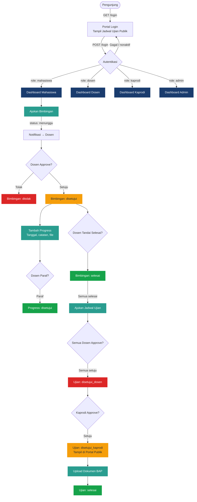

<div align="center">

# BIOS Track

### Bimbingan & Informasi Output Skripsi — Tracking System

*Platform manajemen bimbingan dan ujian skripsi berbasis web untuk institusi pendidikan tinggi.*

[](https://opensource.org/licenses/MIT)
[](https://laravel.com)
[](https://www.php.net)
[](https://vitejs.dev)
[](https://tailwindcss.com)
[](https://www.mysql.com)
[](https://phpunit.de)

</div>

---

## Table of Contents

- [About the Project](#-about-the-project)
- [Built With](#-built-with)
- [System Architecture](#-system-architecture)
- [Database Schema](#-database-schema)
- [Features](#-features)
- [Roles & Access Control](#-roles--access-control)
- [Getting Started](#-getting-started)
  - [Prerequisites](#prerequisites)
  - [Installation](#installation)
  - [Environment Configuration](#environment-configuration)
- [Usage](#-usage)
  - [Running the Application](#running-the-application)
  - [Creating an Admin Account](#creating-an-admin-account)
  - [Application Workflow](#application-workflow)
- [Project Structure](#-project-structure)
- [Roadmap](#-roadmap)
- [License](#-license)
- [Contact](#-contact)

---

## About the Project

BIOS Track (*Bimbingan & Informasi Output Skripsi — Tracking System*) adalah aplikasi web fullstack yang dirancang untuk **mengotomasi dan mendigitalisasi seluruh siklus hidup penyelesaian skripsi mahasiswa** di lingkungan perguruan tinggi.

### Masalah yang Dipecahkan

Proses bimbingan skripsi tradisional sering kali melibatkan koordinasi manual yang rawan kesalahan: berkas fisik, komunikasi via pesan singkat, dan ketiadaan *audit trail* yang terstruktur. BIOS Track menyelesaikan masalah ini dengan menyediakan:

- **Alur kerja digital end-to-end** dari pengajuan bimbingan hingga pengesahan ujian akhir
- **Persetujuan bertingkat** (*multi-tier approval*) yang dapat dikonfigurasi: Mahasiswa → Dosen → Kaprodi
- **Portal publik** yang menampilkan jadwal ujian tanpa autentikasi, menjamin transparansi institusional
- **Notifikasi in-app real-time** yang mengeliminasi kebutuhan komunikasi di luar platform
- **Audit trail lengkap** pada setiap perubahan status bimbingan dan ujian

### Keputusan Arsitektur

| Keputusan | Pilihan | Alasan |
|-----------|---------|--------|
| Backend Framework | Laravel 12 | Ekosistem matang, Eloquent ORM, artisan CLI, built-in queue & notification |
| Templating | Blade + Tailwind CSS 4 | Server-side rendering, zero JS overhead untuk halaman non-interaktif |
| Build Tool | Vite 7 | HMR ultra-cepat, native ESM, integrasi first-class dengan Laravel |
| PDF Generation | barryvdh/laravel-dompdf | Tanpa dependensi binary eksternal, mudah dikustomisasi via Blade view |
| Database | MySQL 8 | Dukungan penuh untuk `ALTER TABLE`, constraint FK, dan JSON column jika dibutuhkan |
| Queue | Laravel Built-in Queue | Decoupling pengiriman notifikasi dari request cycle HTTP |

---

## Built With

### Backend
| Teknologi | Versi | Fungsi |
|-----------|-------|--------|
| PHP | `^8.2` | Runtime bahasa utama |
| Laravel Framework | `^12.0` | MVC framework, routing, ORM, queue, autentikasi |
| Laravel Tinker | `^2.10` | REPL interaktif untuk manajemen data |
| barryvdh/laravel-dompdf | `^3.1` | Ekspor riwayat bimbingan ke PDF |

### Frontend
| Teknologi | Versi | Fungsi |
|-----------|-------|--------|
| Blade Templating | — | Server-side HTML rendering |
| Tailwind CSS | `^4.0` | Utility-first CSS framework |
| Vite | `^7.0` | Asset bundler & HMR dev server |
| Axios | `^1.11` | HTTP client untuk AJAX (notifikasi) |

### Dev Tools
| Alat | Fungsi |
|------|--------|
| Laravel Pail | Real-time log viewer di terminal |
| Laravel Pint | Opinionated PHP code formatter (PSR-12) |
| Laravel Sail | Docker-based local development environment |
| PHPUnit `^11.5` | Unit & Feature testing |
| Mockery `^1.6` | Mock objects untuk testing |
| concurrently | Menjalankan multiple processes (server, queue, vite) serentak |

---

## System Architecture

BIOS Track menggunakan arsitektur **Monolitik MVC (Model-View-Controller)** dengan pemisahan kekhawatiran (*separation of concerns*) yang ketat melalui Middleware-based RBAC.

```
┌─────────────────────────────────────────────────────────────┐
│                        CLIENT BROWSER                        │
│              Blade Views + Tailwind CSS + Axios              │
└──────────────────────────┬──────────────────────────────────┘
                           │ HTTPS Request
┌──────────────────────────▼──────────────────────────────────┐
│                      LARAVEL 12 APP                          │
│  ┌──────────────┐   ┌────────────────┐   ┌───────────────┐  │
│  │   Routes     │──▶│   Middleware   │──▶│  Controllers  │  │
│  │  (web.php)   │   │ RoleMiddleware │   │  (10 files)   │  │
│  └──────────────┘   └────────────────┘   └───────┬───────┘  │
│                                                   │          │
│  ┌────────────────────────────────────────────────▼───────┐  │
│  │                    ELOQUENT ORM                         │  │
│  │  User · Bimbingan · BimbinganProgress · Ujian ·        │  │
│  │  UjianDokumen · Notification                           │  │
│  └────────────────────────────────────────────────────────┘  │
│                                                               │
│  ┌─────────────────┐   ┌──────────────────────────────────┐  │
│  │  Laravel Queue  │   │   Storage (Local Disk)           │  │
│  │  (Notifications)│   │   signatures/ · progress-files/  │  │
│  │                 │   │   ujian-dokumen/                 │  │
│  └─────────────────┘   └──────────────────────────────────┘  │
└──────────────────────────┬──────────────────────────────────┘
                           │
┌──────────────────────────▼──────────────────────────────────┐
│                       MySQL 8 DATABASE                       │
│  users · bimbingans · bimbingan_progresses · ujians ·        │
│  ujian_dokumens · notifications · cache · jobs               │
└─────────────────────────────────────────────────────────────┘
```

### Alur Persetujuan Bertingkat



---

## Database Schema

### Entity Relationship Overview

```
users (mahasiswa) ──< bimbingans >── users (dosen)
                       │
                       └──< bimbingan_progresses

users (mahasiswa) ──< ujians >── users (dosen_pembimbing1)
                         │   ├── users (dosen_pembimbing2)
                         │   ├── users (dosen_penguji1)
                         │   └── users (dosen_penguji2)
                         │
                         └──< ujian_dokumens

users ──< notifications (user_id = penerima)
users ──< notifications (sender_id = pengirim)
```

### Tabel: `users`
| Kolom | Tipe | Keterangan |
|-------|------|------------|
| `id` | `bigint PK` | Auto-increment |
| `name` | `varchar` | Nama lengkap |
| `email` | `varchar UNIQUE` | Email login |
| `username` | `varchar UNIQUE NULL` | Username opsional |
| `password` | `varchar` | Bcrypt hash |
| `role` | `enum` | `mahasiswa` \| `dosen` \| `kaprodi` \| `admin` |
| `nim` | `varchar NULL` | Nomor Induk Mahasiswa |
| `nip` | `varchar NULL` | Nomor Induk Pegawai |
| `prodi` | `varchar NULL` | Program Studi |
| `angkatan` | `varchar NULL` | Tahun angkatan |
| `phone` | `varchar NULL` | Nomor telepon |
| `signature_path` | `varchar NULL` | Path file tanda tangan digital |
| `is_active` | `boolean` | Default `true`; `false` = akun diblokir |

### Tabel: `bimbingans`
| Kolom | Tipe | Keterangan |
|-------|------|------------|
| `id` | `bigint PK` | |
| `mahasiswa_id` | `FK → users` | |
| `dosen_id` | `FK → users` | Pembimbing yang ditunjuk |
| `jenis_bimbingan` | `enum` | `proposal` \| `seminar_hasil` \| `laporan_skripsi` |
| `pembimbing` | `integer` | `1` = Pembimbing Utama, `2` = Pembimbing Pendamping |
| `tanggal_bimbingan` | `date NULL` | Tanggal rencana bimbingan |
| `topik` | `varchar NULL` | Topik sesi bimbingan |
| `catatan_mahasiswa` | `text NULL` | |
| `catatan_dosen` | `text NULL` | Feedback dari dosen |
| `catatan_kaprodi` | `text NULL` | Feedback dari kaprodi |
| `status` | `enum` | `menunggu` \| `disetujui` \| `ditolak` \| `selesai` |
| `approved_at` | `timestamp NULL` | |
| `selesai_at` | `timestamp NULL` | |

### Tabel: `bimbingan_progresses`
| Kolom | Tipe | Keterangan |
|-------|------|------------|
| `id` | `bigint PK` | |
| `bimbingan_id` | `FK → bimbingans` | |
| `tanggal_bimbingan` | `timestamp NULL` | Tanggal sesi aktual |
| `catatan` | `text` | Catatan progress oleh mahasiswa |
| `file_path` | `varchar NULL` | Attachment (pdf/doc/docx/jpg/png, maks 5MB) |
| `status` | `enum` | `menunggu` \| `disetujui` \| `ditolak` |
| `catatan_dosen` | `text NULL` | |
| `approved_at` | `timestamp NULL` | |

### Tabel: `ujians`
| Kolom | Tipe | Keterangan |
|-------|------|------------|
| `id` | `bigint PK` | |
| `mahasiswa_id` | `FK → users` | |
| `jenis_ujian` | `enum` | `proposal` \| `seminar_hasil` \| `laporan_skripsi` |
| `tanggal_ujian` | `timestamp` | |
| `tempat_ujian` | `varchar` | |
| `dosen_pembimbing1_id` | `FK → users` | Wajib |
| `dosen_pembimbing2_id` | `FK → users NULL` | Opsional |
| `dosen_penguji1_id` | `FK → users` | Wajib |
| `dosen_penguji2_id` | `FK → users NULL` | Opsional |
| `status_pembimbing1` | `enum` | `menunggu` \| `disetujui` \| `ditolak` |
| `status_pembimbing2` | `enum` | `menunggu` \| `disetujui` \| `ditolak` \| `tidak_ada` |
| `status_penguji1` | `enum` | `menunggu` \| `disetujui` \| `ditolak` |
| `status_penguji2` | `enum` | `menunggu` \| `disetujui` \| `ditolak` \| `tidak_ada` |
| `status_kaprodi` | `enum` | `menunggu` \| `disetujui` \| `ditolak` |
| `status` | `enum` | `menunggu` \| `disetujui_dosen` \| `disetujui_kaprodi` \| `ditolak` \| `selesai` |
| `catatan_kaprodi` | `text NULL` | |
| `approved_kaprodi_at` | `timestamp NULL` | |

### Tabel: `notifications`
| Kolom | Tipe | Keterangan |
|-------|------|------------|
| `id` | `bigint PK` | |
| `user_id` | `FK → users` | Penerima notifikasi |
| `sender_id` | `FK → users NULL` | Pengirim notifikasi |
| `title` | `varchar` | |
| `message` | `text` | |
| `type` | `varchar` | `info` \| `success` \| `warning` \| `danger` |
| `url` | `varchar NULL` | Redirect URL saat notifikasi dibuka |
| `notifiable_type` | `varchar NULL` | Polymorphic class name |
| `notifiable_id` | `bigint NULL` | Polymorphic record ID |
| `is_read` | `boolean` | Default `false` |
| `read_at` | `timestamp NULL` | |

---

## Features

### Autentikasi & Manajemen Akun
- Login dengan email/password dan opsi *remember me*
- Registrasi mandiri untuk mahasiswa (role otomatis `mahasiswa`)
- Pemblokiran akun: login ditolak jika `is_active = false`
- Update profil: nama, nomor telepon, upload tanda tangan digital, ganti password

### Portal Publik
- Menampilkan jadwal ujian yang telah disetujui kaprodi (`status = disetujui_kaprodi`) **tanpa login**
- Dibatasi 50 ujian mendatang secara default

### Manajemen Bimbingan (Mahasiswa)
- Pengajuan bimbingan dengan memilih dosen, jenis bimbingan, slot pembimbing (1 atau 2), topik, dan catatan
- Dukungan hingga **2 pembimbing per jenis bimbingan** dalam slot terpisah
- Tambah, edit, dan lacak progress bimbingan dengan lampiran file
- Ekspor riwayat bimbingan ke **PDF** (powered by dompdf)

### Manajemen Ujian (Mahasiswa)
- Pengajuan ujian hanya tersedia **setelah semua bimbingan berstatus `selesai`**
- Konfigurasi 1–2 dosen pembimbing dan 1–2 dosen penguji
- Upload dokumen pasca-ujian: **BAP (wajib)** dan berkas nilai (opsional)
- Status ujian otomatis berubah menjadi `selesai` setelah dokumen diunggah

### Dashboard Dosen
- Approve/tolak pengajuan bimbingan dengan catatan
- Paraf (approve/tolak) setiap entri progress bimbingan
- Tandai bimbingan sebagai `selesai` atau `tidak selesai`
- Approve/tolak pengajuan jadwal ujian

### Dashboard Kaprodi
- Semua akses dosen via middleware `role:dosen,kaprodi`
- Overview semua mahasiswa beserta status progressnya
- Feedback pada bimbingan lintas mahasiswa
- **Approval final ujian** — hanya setelah seluruh dosen menyetujui

### Dashboard Admin
- CRUD pengguna untuk semua role dengan pagination dan filter
- Toggle aktif/nonaktif akun pengguna
- Monitoring bimbingan dan ujian (**view-only**, tanpa aksi approval)

### Notifikasi In-App
- Notifikasi dikirim otomatis pada setiap event kritis
- Unread count badge di semua halaman
- JSON API endpoint: `GET /notifications/unread`
- Tandai satu atau semua notifikasi sebagai telah dibaca
- Redirect otomatis ke halaman terkait saat notifikasi dibuka

---

## Roles & Access Control

Sistem menggunakan `RoleMiddleware` kustom untuk menjaga isolasi akses antar role.

| Role | Prefix URL | Cara Pembuatan | Hak Utama |
|------|-----------|----------------|-----------|
| `mahasiswa` | `/mahasiswa/` | Registrasi mandiri | Ajukan bimbingan, catat progress, ajukan ujian, upload dokumen |
| `dosen` | `/dosen/` | Dibuat oleh admin | Approve bimbingan, paraf progress, approve ujian |
| `kaprodi` | `/kaprodi/` + `/dosen/` | Dibuat oleh admin | Semua akses dosen + approval final ujian + oversight |
| `admin` | `/admin/` | Dibuat via Tinker | CRUD user, monitoring (view-only) |

### Routing Matrix

| Prefix | Middleware | Scope |
|--------|-----------|-------|
| `/mahasiswa/` | `role:mahasiswa` | Bimbingan, progress, ujian, dokumen, PDF export |
| `/dosen/` | `role:dosen,kaprodi` | Approval bimbingan, progress, ujian |
| `/kaprodi/` | `role:kaprodi` | Oversight mahasiswa, approval ujian final |
| `/admin/` | `role:admin` | CRUD user, monitoring |
| `/notifications/`, `/profile` | `auth` | Notifikasi dan profil (semua role) |

---

## Getting Started

### Prerequisites

Pastikan lingkungan pengembangan Anda memenuhi persyaratan berikut:

| Dependency | Versi Minimum | Keterangan |
|------------|---------------|------------|
| PHP | `8.2` | Dengan ekstensi: `mbstring`, `pdo_mysql`, `fileinfo`, `gd` |
| Composer | `2.x` | PHP dependency manager |
| Node.js | `18.x` | JavaScript runtime |
| npm | `9.x` | Node package manager |
| MySQL | `8.x` | Database server |
| Git | `2.x` | Version control |

Untuk memverifikasi:

```bash
php --version
composer --version
node --version
npm --version
mysql --version
```

### Installation

#### Metode 1: Instalasi Manual (Direkomendasikan)

```bash
# 1. Clone repository
git clone https://github.com/<your-username>/bios-track.git
cd bios-track

# 2. Install dependensi PHP
composer install

# 3. Salin file konfigurasi environment
cp .env.example .env

# 4. Generate application key
php artisan key:generate

# 5. Konfigurasi database (lihat bagian Environment Configuration)
# Edit file .env sesuai konfigurasi database lokal Anda

# 6. Jalankan migrasi database
php artisan migrate

# 7. Buat symbolic link storage
php artisan storage:link

# 8. Install dependensi JavaScript
npm install

# 9. Build aset frontend
npm run build
```

#### Metode 2: Menggunakan Script `composer setup`

Script ini mengotomasi langkah 2–9 secara berurutan (kecuali konfigurasi `.env` dan `storage:link`):

```bash
# Pastikan .env sudah dikonfigurasi terlebih dahulu
cp .env.example .env
# Edit .env dengan kredensial database Anda
composer setup
```

### Environment Configuration

Buka file `.env` dan sesuaikan variabel berikut:

```ini
# ─── Application ─────────────────────────────────────────
APP_NAME="BIOS Track"
APP_ENV=local
APP_DEBUG=true
APP_URL=http://localhost:8000

# ─── Database ─────────────────────────────────────────────
DB_CONNECTION=mysql
DB_HOST=127.0.0.1
DB_PORT=3306
DB_DATABASE=bios_track
DB_USERNAME=root
DB_PASSWORD=your_password

# ─── Session & Queue ──────────────────────────────────────
SESSION_DRIVER=database
QUEUE_CONNECTION=database

# ─── Storage ──────────────────────────────────────────────
FILESYSTEM_DISK=local

# ─── Mail (Opsional) ──────────────────────────────────────
MAIL_MAILER=log       # Gunakan 'smtp' untuk production
MAIL_HOST=127.0.0.1
MAIL_PORT=2525
```

> **Catatan Keamanan:** Jangan pernah meng-commit file `.env` ke dalam version control. File ini sudah tercantum dalam `.gitignore` secara default.

---

## Usage

### Running the Application

#### Development Mode

Perintah berikut menjalankan seluruh stack development secara bersamaan menggunakan `concurrently`:

```bash
composer dev
```

Ini akan menjalankan secara paralel:
- **`php artisan serve`** — Web server di `http://localhost:8000`
- **`php artisan queue:listen`** — Queue worker untuk notifikasi
- **`php artisan pail`** — Real-time log viewer di terminal
- **`npm run dev`** — Vite dev server dengan Hot Module Replacement (HMR)

#### Production Mode

```bash
# Build aset frontend yang dioptimalkan
npm run build

# Cache konfigurasi, route, dan view untuk performa optimal
php artisan config:cache
php artisan route:cache
php artisan view:cache

# Jalankan server (gunakan web server seperti Nginx/Apache di production)
php artisan serve
```

### Creating an Admin Account

Karena registrasi mandiri hanya tersedia untuk role `mahasiswa`, akun admin pertama harus dibuat via Laravel Tinker:

```bash
php artisan tinker
```

```php
App\Models\User::create([
    'name'      => 'Administrator',
    'email'     => 'admin@example.com',
    'password'  => bcrypt('your_secure_password'),
    'role'      => 'admin',
    'is_active' => true,
]);
```

Setelah akun admin aktif, gunakan dashboard admin (`/admin/users`) untuk membuat akun dosen dan kaprodi.

### Application Workflow

#### 1. Alur Bimbingan

```
[Mahasiswa]  POST /mahasiswa/bimbingan
                └─► status: menunggu → notifikasi dikirim ke dosen

[Dosen]      POST /dosen/bimbingan/{id}/approve
                └─► status: disetujui | ditolak → notifikasi ke mahasiswa

[Mahasiswa]  POST /mahasiswa/bimbingan/{id}/progress
                └─► status progress: menunggu paraf → notifikasi ke dosen

[Dosen]      POST /dosen/progress/{id}/approve
                └─► status progress: disetujui | ditolak

[Dosen]      POST /dosen/bimbingan/{id}/selesai
                └─► status: selesai
```

#### 2. Alur Ujian

```
[Mahasiswa]  POST /mahasiswa/ujian            ← Syarat: SEMUA bimbingan selesai
                └─► status: menunggu → notifikasi ke semua dosen terlibat

[Dosen]      POST /dosen/ujian/{id}/approve   ← Setiap dosen melakukan approval
                └─► Jika semua approve: status = disetujui_dosen
                └─► notifikasi ke kaprodi

[Kaprodi]    POST /kaprodi/ujian/{id}/approve ← Syarat: status = disetujui_dosen
                └─► status: disetujui_kaprodi (tampil di portal publik) | ditolak

[Mahasiswa]  POST /mahasiswa/ujian/{id}/dokumen
                └─► Upload BAP (wajib) + berkas nilai (opsional)
                └─► status: selesai → notifikasi ke semua dosen terlibat
```

#### 3. Notification API

```bash
# Ambil notifikasi yang belum dibaca (JSON)
GET /notifications/unread

# Tandai notifikasi tertentu sebagai dibaca
POST /notifications/{id}/read

# Tandai semua notifikasi sebagai dibaca
POST /notifications/read-all
```

#### 4. Running Tests

```bash
# Jalankan seluruh test suite
composer test

# Atau secara langsung via artisan
php artisan test

# Jalankan test spesifik
php artisan test --filter=BimbinganTest

# Generate test coverage report (memerlukan Xdebug)
php artisan test --coverage
```

---

## Project Structure

```
bios-track/
├── app/
│   ├── Http/
│   │   ├── Controllers/
│   │   │   ├── AdminController.php              # CRUD user, monitoring (admin only)
│   │   │   ├── AuthController.php               # Login, register, logout, profile
│   │   │   ├── BimbinganController.php          # CRUD bimbingan (mahasiswa & dosen)
│   │   │   ├── BimbinganProgressController.php  # Progress bimbingan + paraf dosen
│   │   │   ├── DashboardController.php          # Dashboard per role + PDF export
│   │   │   ├── KaprodiController.php            # Oversight mahasiswa + approval ujian
│   │   │   ├── NotificationController.php       # Notifikasi (list, read, JSON API)
│   │   │   ├── UjianController.php              # CRUD ujian (mahasiswa & dosen)
│   │   │   └── UjianDokumenController.php       # Upload dokumen pasca-ujian
│   │   └── Middleware/
│   │       └── RoleMiddleware.php               # Guard akses berbasis role
│   └── Models/
│       ├── User.php                             # Role helper + relasi ke semua entitas
│       ├── Bimbingan.php                        # Model bimbingan + konstanta JENIS
│       ├── BimbinganProgress.php                # Entri progress per sesi bimbingan
│       ├── Ujian.php                            # Jadwal ujian + status per dosen
│       ├── UjianDokumen.php                     # Dokumen BAP & nilai
│       └── Notification.php                    # Notifikasi in-app + helper send()
├── database/
│   ├── migrations/                              # 13 file migrasi (MySQL)
│   └── seeders/
│       └── DatabaseSeeder.php
├── resources/
│   ├── views/
│   │   ├── layouts/                             # Layout utama aplikasi
│   │   ├── auth/                               # Login, register, profile
│   │   ├── mahasiswa/                          # Dashboard, bimbingan, ujian, kartu kendali
│   │   ├── dosen/                              # Dashboard, bimbingan, ujian
│   │   ├── kaprodi/                            # Dashboard, mahasiswa, bimbingan, ujian
│   │   ├── admin/                              # Dashboard, users, monitoring
│   │   └── shared/                             # Komponen bersama (notifikasi)
│   ├── css/app.css
│   └── js/app.js
├── routes/
│   └── web.php                                  # Seluruh routing web
├── storage/app/public/
│   ├── signatures/                              # Tanda tangan digital dosen
│   ├── bimbingan-progress/                      # Attachment progress bimbingan
│   └── ujian-dokumen/                           # Berkas BAP dan nilai
├── tests/
│   ├── Feature/                                 # Integration & feature tests
│   └── Unit/                                    # Unit tests
├── composer.json
├── package.json
└── vite.config.js
```

---

## 🗺 Roadmap

Berikut adalah rencana pengembangan fitur dan peningkatan teknis yang direncanakan:

- [ ] **Email Notification** — Integrasi SMTP untuk mengirim notifikasi via email selain notifikasi in-app
- [ ] **Jadwal Bimbingan Terpadu** — Kalender interaktif untuk visualisasi jadwal bimbingan per dosen
- [ ] **Laporan Statistik Kaprodi** — Dashboard analytics dengan chart (progress mahasiswa per angkatan, tingkat kelulusan)
- [ ] **Multi-Prodi Support** — Mendukung beberapa program studi dalam satu instance aplikasi
- [ ] **API RESTful** — Expose API untuk integrasi dengan sistem akademik institusi (SIAKAD)
- [ ] **Ekspor Excel** — Ekspor data bimbingan dan ujian ke format `.xlsx` untuk keperluan pelaporan
- [ ] **Two-Factor Authentication (2FA)** — Peningkatan keamanan login untuk role dosen dan kaprodi
- [ ] **Arsip Otomatis** — Auto-archiving data bimbingan dan ujian yang sudah selesai per semester
- [ ] **Progressive Web App (PWA)** — Dukungan offline dan notifikasi push browser

---

## License

Distributed under the **MIT License**. See [`LICENSE`](LICENSE) for more information.

---

## Contact

| | |
|---|---|
| **Project Maintainer** | *Abu Bakar* |
| **Email** | *abubakar.it.dev@gmail.com* |
| **GitHub** | [@abakarbit](https://github.com/abakarbit/) |
| **Project Link** | [https://github.com/abakarbit/bios-track](https://github.com/abakarbit/bios-track) |

---

<div align="center">

Made with ❤️ using [Laravel](https://laravel.com) · [Tailwind CSS](https://tailwindcss.com) · [Vite](https://vitejs.dev)

</div>

